# Portal de Reserva


### **CT-001: Realizar reserva com sucesso**
**Requisitos**
Estar na aba Reserva

**Passo a Passo**
```
Dado que estou na página de reservas
Quando informo uma data válida de check-in
E informo uma data válida de check-out
E informo a quantidade de hóspedes
E seleciono um quarto "Standard, Deluxe ou Suíte Presidencial"
E preencho o nome completo
E preencho um e-mail
E preencho um telefone
E clicar no botão confirmar reserva
Então devo visualizar uma mensagem de sucesso 
E a reserva deve ser exibida na aba CRM
```

**Critério de aceitação**
- O sistema deve permitir a criação da reserva com dados válidos.
- Deve ser exibida uma mensagem de sucesso.
- A reserva deve estar disponível para consulta no CRM.

**Resultado**
- Mensagem de sucesso exibida.
- Reserva realizada com sucesso.

**Evidencia de teste referente ao teste CT-001**      
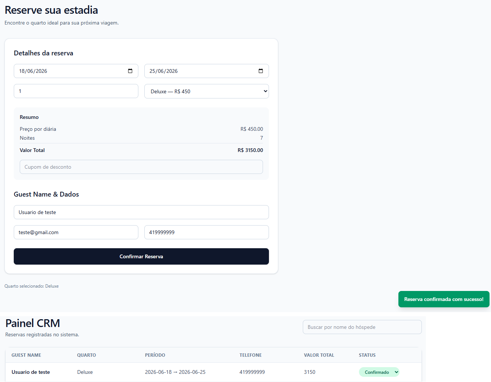


### **CT-002: Realizar reserva sem informações**
**Requisitos**
Estar na aba Reserva

**Passo a Passo**
```
Dado que estou na página de reservas
Quando clicar no botão confirmar reserva
Então devo visualizar uma mensagem de erro
E a reserva não deve ser exibida na aba CRM
```

**Critério de aceitação**
- Deve informar uma mensagem de erro da reserva
- Deve mostrar qual campo precisa ser preenchido
- Não deve cadastrar a reserva na aba CRM

**Resultado**
- Mensagem de reserva cadastrada
- Reserva cadastrada na página CRM

**Evidencia de teste referente ao teste CT-002**       
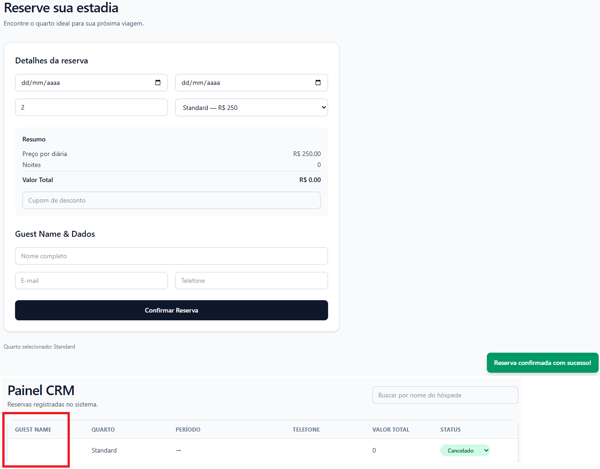


### **CT-003: Realizar reserva com cupom de desconto**
**Requisitos**
Estar na aba Reserva
Cupom PROMO10

**Passo a Passo**
```
Dado que estou na página de reservas
Quando informo uma data válida de check-in
E informo uma data válida de check-out
E informo a quantidade de hóspedes
E seleciono um quarto "Standard, Deluxe ou Suíte Presidencial"
E Preencho o Cupom de desconto com "PROMO10"
E preencho o nome completo
E preencho um e-mail
E preencho um telefone
E clicar no botão confirmar reserva
Então devo visualizar uma mensagem de sucesso
E a reserva deve ser exibida na aba CRM
```

**Critério de aceitação**
- O sistema deve permitir a criação da reserva com dados válidos.
- Deve ser exibida uma mensagem de sucesso.
- A reserva deve estar disponível para consulta no CRM.
- Deve atualizar o valor antes de confirmar
- Deve mostrar o desconto na página CRM

**Resultado**
- Reserva realizada com sucesso.
- Mensagem de sucesso exibida.
- Acrescentou um valor à mais
- Acrescentou um valor à mais na página CRM

**Evidencia de teste referente ao teste CT-003**       
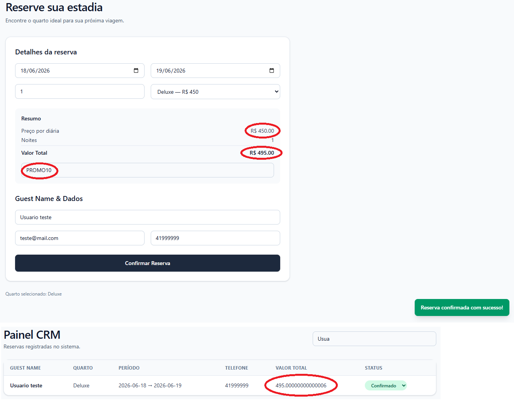


### **CT-004: Realizar reserva com cupom que não exista**
**Requisitos**
Estar na aba Reserva

**Passo a Passo**
```
Dado que estou na página de reservas
Quando informo uma data válida de check-in
E informo uma data válida de check-out
E informo a quantidade de hóspedes
E seleciono um quarto "Standard, Deluxe ou Suíte Presidencial"
E Preencho o Cupom de desconto não cadastrado "DESC100"
E preencho o nome completo
E preencho um e-mail
E preencho um telefone
E clicar no botão confirmar reserva
Então devo visualizar uma mensagem de erro
E a reserva não deve ser exibida na aba CRM
```

**Critério de aceitação**
- Deve informar uma mensagem de erro da reserva
- Não deve cadastrar a reserva na aba CRM
- Deve informar que o cupom de desconto não existe

**Resultado**
- Mensagem de reserva cadastrada
- Reserva cadastrada na página CRM

**Evidencia de teste referente ao teste CT-004**      
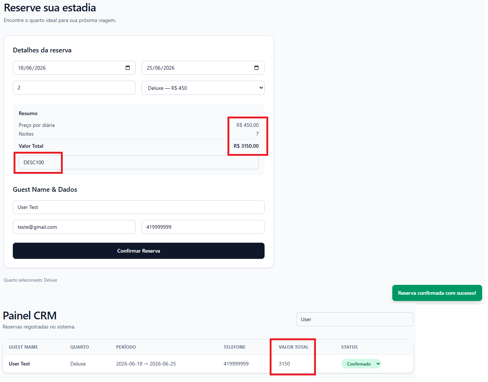


### **CT-005: Realizar reserva com data de check-in no passado**
**Requisitos**
Estar na aba Reserva

**Passo a Passo**
```
Dado que estou na página de reservas
Quando informo uma data de check-in anterior da data de teste
E informo uma data de check-out anterior da data de teste
E informo a quantidade de hóspedes
E seleciono um quarto "Standard, Deluxe ou Suíte Presidencial"
E preencho o nome completo
E preencho um e-mail
E preencho um telefone
E clicar no botão confirmar reserva
Então devo visualizar uma mensagem de erro
E a reserva não deve ser exibida na aba CRM
```

**Critério de aceitação**
- Deve informar uma mensagem de erro da reserva
- Não deve cadastrar a reserva na aba CRM
- Deve informar que a data deve ser atual

**Resultado**
- Mensagem de reserva cadastrada
- Reserva cadastrada na página CRM

**Evidencia de teste referente ao teste CT-005**       
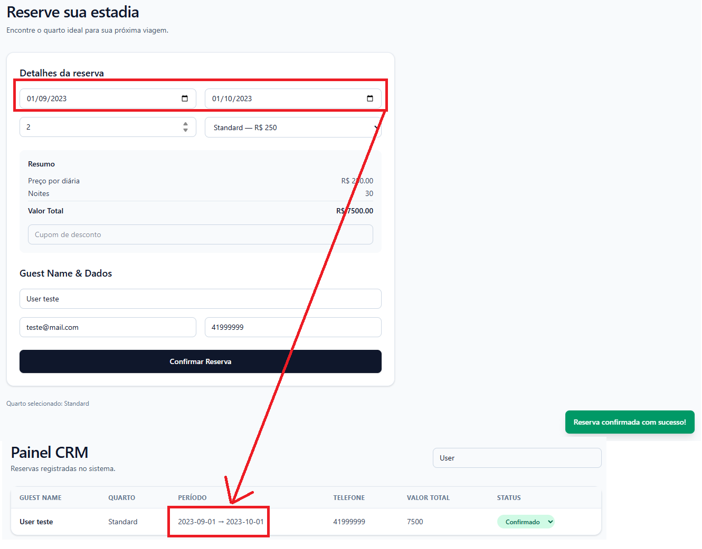


### **CT-006: Realizar reserva com período de hospedagem excessivamente longo**
**Requisitos**
Estar na aba Reserva

**Passo a Passo**
```
Dado que estou na página de reservas
Quando informo uma data de check-in mais próximo da data de teste
E informo uma data de check-out muito posterior da data de teste
E informo a quantidade de hóspedes
E seleciono um quarto "Standard, Deluxe ou Suíte Presidencial"
E preencho o nome completo
E preencho um e-mail
E preencho um telefone
E clicar no botão confirmar reserva
Então devo visualizar uma mensagem de sucesso
E a reserva deve ser exibida na aba CRM
```

**Critério de aceitação**
- O sistema deve permitir a criação da reserva com datas longas.
- Deve ser exibida uma mensagem de sucesso.
- A reserva deve estar disponível para consulta no CRM.

**Resultado**
- Mensagem de sucesso exibida.
- Reserva realizada com sucesso.

**Evidencia de teste referente ao teste CT-006**      
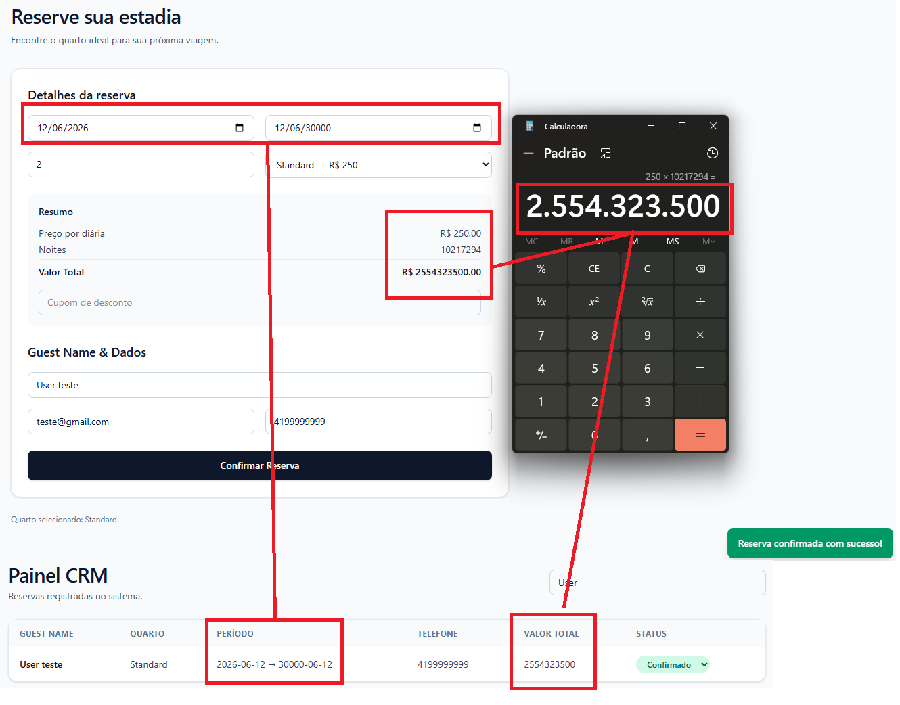


### **CT-007: Realizar reserva com check-out anterior ao check-in**
**Requisitos**
- Estar na aba Reserva
- Inserir a data de check-in posterior da data de check-out

**Passo a Passo**
```
Dado que estou na página de reservas
Quando informo uma data de check-in posterior da data de check-out
E informo uma data de check-out anterior da data de check-in
E informo a quantidade de hóspedes
E seleciono um quarto "Standard, Deluxe ou Suíte Presidencial"
E preencho o nome completo
E preencho um e-mail
E preencho um telefone
E clicar no botão confirmar reserva
Então devo visualizar uma mensagem de erro
E a reserva não deve ser exibida na aba CRM
```

**Critério de aceitação**
- Deve informar uma mensagem de erro da reserva
- Não deve cadastrar a reserva na aba CRM
- Deve informar que a data de check-out deve ser posterior com a data de check-in

**Resultado**
- Mensagem de reserva cadastrada
- Reserva cadastrada na página CRM
- Negativado a soma do valor total

**Evidencia de teste referente ao teste CT-007**      
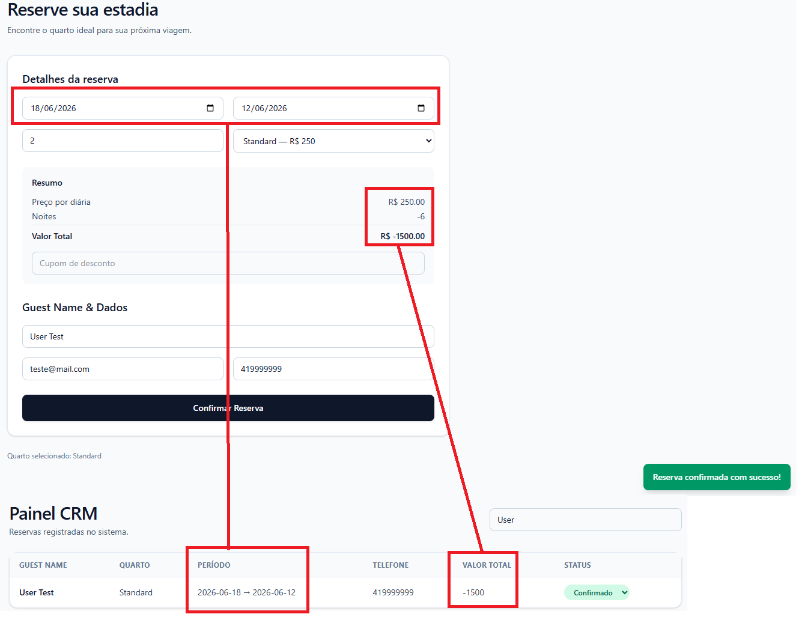


### **CT-008: Realizar reserva preenchida com letras na data**
**Requisitos**
- Estar na aba Reserva
- Utilizar o DeveTools para alterar o elemento

**Passo a Passo**
```
Dado que estou na página de reservas
Quando altero o elemento do check-in para texto
E adiciono uma letra no Check-in
E altero o elemento do check-out para texto
E adiciono uma letra no Check-out
E informo a quantidade de hóspedes
E seleciono um quarto "Standard, Deluxe ou Suíte Presidencial"
E preencho o nome completo
E preencho um e-mail
E preencho um telefone
E clicar no botão confirmar reserva
Então devo visualizar uma mensagem de erro
E a reserva não deve ser exibida na aba CRM
```

**Critério de aceitação**
- Deve informar uma mensagem de erro da reserva
- Não deve cadastrar a reserva na aba CRM
- Deve informar que a data de check-in e check-out está com problema

**Resultado**
- Mensagem de reserva cadastrada
- Reserva cadastrada na página CRM
- Aba CRM está mostrando a data com letra

**Evidencia de teste referente ao teste CT-008**       
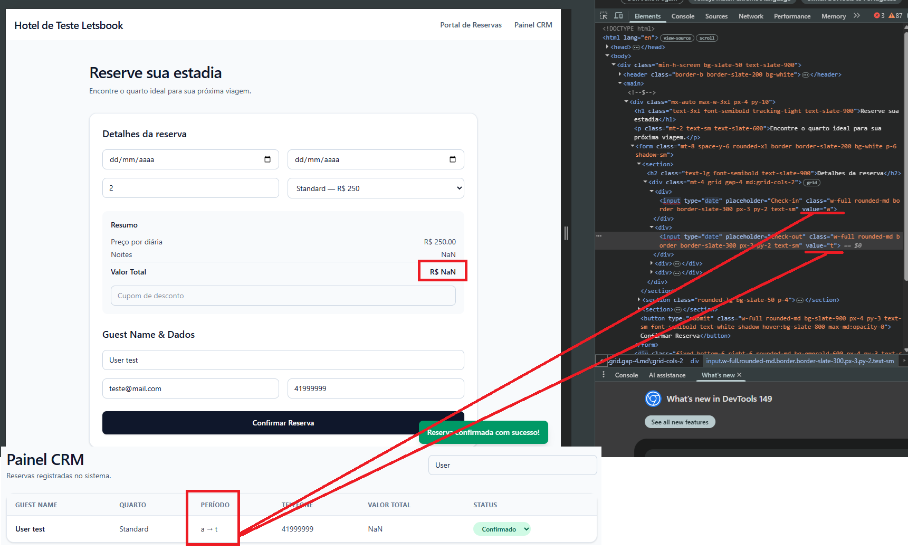


### **CT-009: Realizar reserva com check-in e check-out na mesma data**
**Requisitos**
- Estar na aba Reserva

**Passo a Passo**
```
Dado que estou na página de reservas
Quando informo uma data de check-in
E informo a data de check-out no mesmo dia que a data check-in
E informo a quantidade de hóspedes
E seleciono um quarto "Standard, Deluxe ou Suíte Presidencial"
E preencho o nome completo
E preencho um e-mail
E preencho um telefone
E clicar no botão confirmar reserva
Então devo visualizar uma mensagem de erro
E a reserva não deve ser exibida na aba CRM
```

**Critério de aceitação**
- Deve informar uma mensagem de erro da reserva
- Não deve cadastrar a reserva na aba CRM
- Deve informar que a data de check-out e check-in não devem ser iguais

**Resultado**
- Mensagem de reserva cadastrada
- Reserva cadastrada na página CRM
- Reserva cadastrada sem valor total

**Evidencia de teste referente ao teste CT-009**       
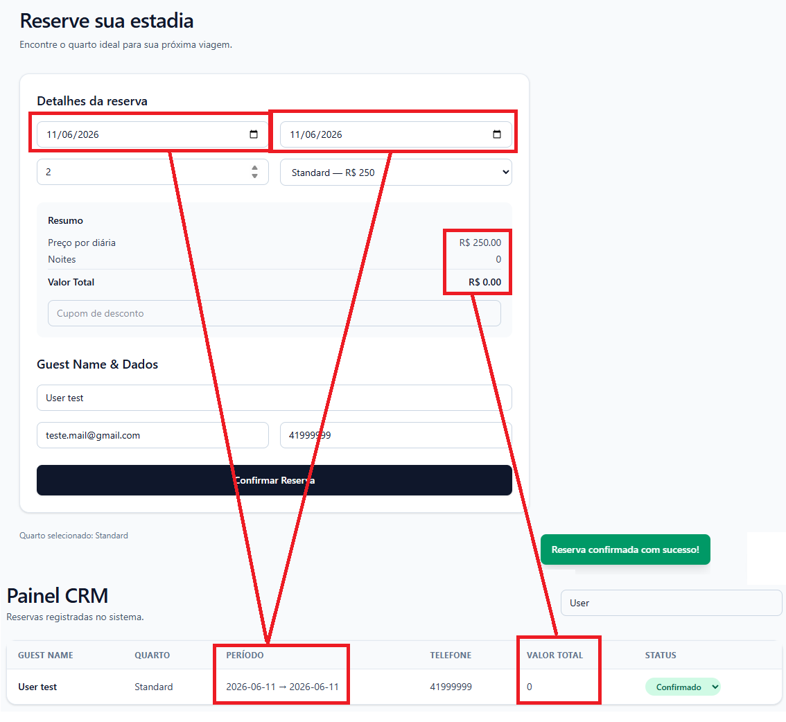


### **CT-010: Realizar reserva com 0 ou menos hóspede**
**Requisitos**
- Estar na aba Reserva

**Passo a Passo**
```
Dado que estou na página de reservas
Quando informo uma data válida de check-in
E informo uma data válida de check-out
E informo a quantidade de 0 ou menos hóspedes
E seleciono um quarto "Standard, Deluxe ou Suíte Presidencial"
E preencho o nome completo
E preencho um e-mail
E preencho um telefone
E clicar no botão confirmar reserva
Então devo visualizar uma mensagem de erro
E a reserva não deve ser exibida na aba CRM
```

**Critério de aceitação**
- Deve informar uma mensagem de erro da reserva
- Não deve cadastrar a reserva na aba CRM
- Deve informar que a quantidade de hóspedes deve ser 1 ou mais

**Resultado**
- Mensagem de reserva cadastrada
- Reserva cadastrada na página CRM
- Reserva cadastrada com 0 ou menos hóspedes

**Evidencia de teste referente ao teste CT-010**     
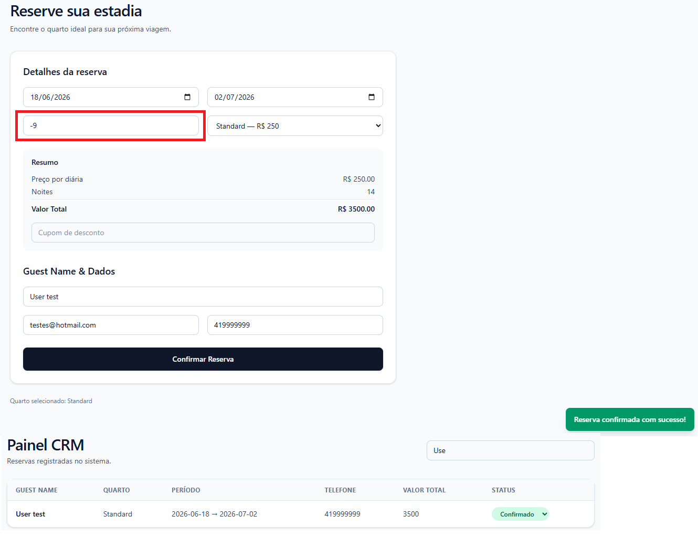


### **CT-011: Realizar reserva com muitos hóspedes**
**Requisitos**
- Estar na aba Reserva

**Passo a Passo**
```
Dado que estou na página de reservas
Quando informo uma data válida de check-in
E informo uma data válida de check-out
E informo a quantidade alta de hóspedes
E seleciono um quarto "Standard, Deluxe ou Suíte Presidencial"
E preencho o nome completo
E preencho um e-mail
E preencho um telefone
E clicar no botão confirmar reserva
Então devo visualizar uma mensagem de erro
E a reserva não deve ser exibida na aba CRM
```

**Critério de aceitação**
- O sistema deve permitir a criação da reserva Com mais de 1 uma pessoa
- Deve ser exibida uma mensagem de sucesso.
- Deve atualizar o valor para a quantidade de hóspedes

**Resultado**
- Mensagem de sucesso exibida.
- Reserva realizada com sucesso.
- Não atualizado o valor total da reserva

**Evidencia de teste referente ao teste CT-011**     
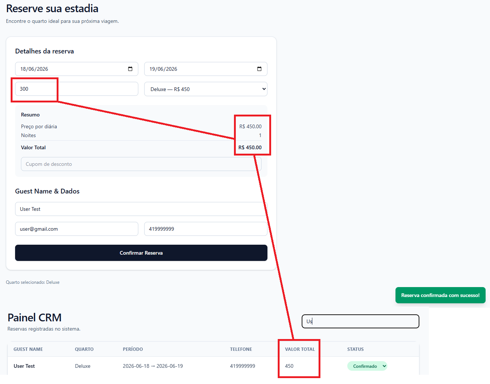


### **CT-012: Realizar reserva com quarto Deluxe**
**Requisitos**
Estar na aba Reserva

**Passo a Passo**
```
Dado que estou na página de reservas
Quando informo uma data válida de check-in
E informo uma data válida de check-out
E informo a quantidade de hóspedes
E seleciono um quarto "Delux"
E preencho o nome completo
E preencho um e-mail
E preencho um telefone
E clicar no botão confirmar reserva
Então devo visualizar uma mensagem de sucesso 
E a reserva deve ser exibida na aba CRM
```

**Critério de aceitação**
- O sistema deve permitir a criação da reserva do quarto Deluxe.
- Deve ser exibida uma mensagem de sucesso.
- Deve ser somado o valor total da reserva
- A reserva deve estar disponível para consulta no CRM.
- O quarto deve estar como "Deluxe"

**Resultado**
- Mensagem de sucesso exibida.
- Reserva realizada com sucesso.
- Atualização no valor total da reserva
- Reserva disponivel na consulta do CRM
- Reserva com o quarto "Deluxe"

**Evidencia de teste referente ao teste CT-012**      
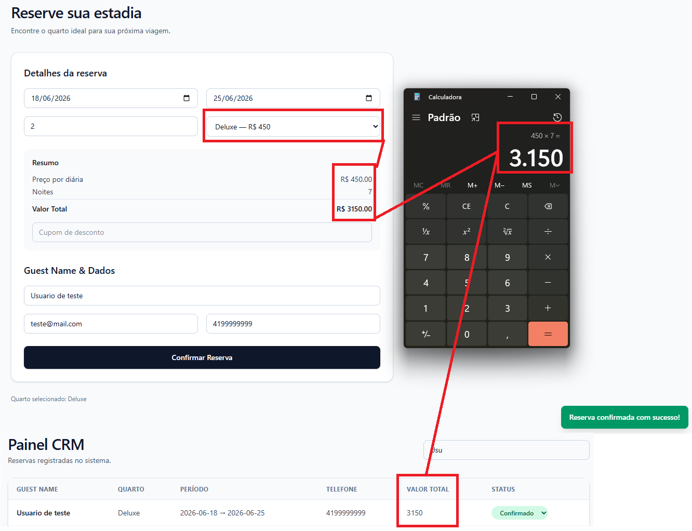


### **CT-013: Realizar reserva com quarto Suíte Presidencial**
**Requisitos**
Estar na aba Reserva

**Passo a Passo**
```
Dado que estou na página de reservas
Quando informo uma data válida de check-in
E informo uma data válida de check-out
E informo a quantidade de hóspedes
E seleciono um quarto "Suíte Presidencial"
E preencho o nome completo
E preencho um e-mail
E preencho um telefone
E clicar no botão confirmar reserva
Então devo visualizar uma mensagem de sucesso 
E a reserva deve ser exibida na aba CRM
```

**Critério de aceitação**
- O sistema deve permitir a criação da reserva do quarto Suíte Presidencial.
- Deve ser exibida uma mensagem de sucesso.
- Deve ser somado o valor total da reserva
- A reserva deve estar disponível para consulta no CRM.
- O quarto deve estar como "Suíte Presidencial"

**Resultado**
- Mensagem de sucesso exibida.
- Reserva realizada com sucesso.
- Atualização errada no valor total da reserva
- Reserva disponivel na consulta do CRM
- Reserva com o quarto "Suíte Presidencial"
- Reserva com o valor errado na aba CRM

**Evidencia de teste referente ao teste CT-013**   
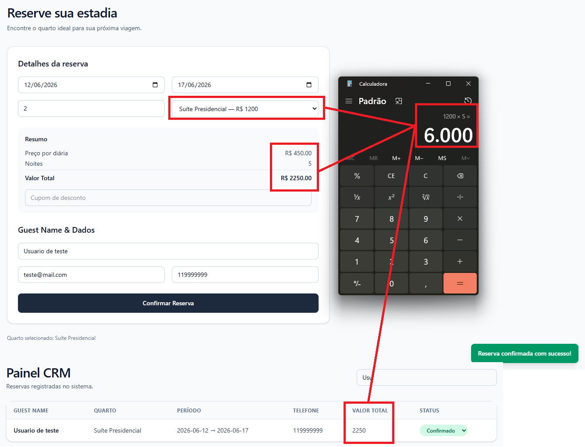


### **CT-014: Realizar reserva utilizando cupom "promo10"**
**Requisitos**
Estar na aba Reserva
Cupom promo10

**Passo a Passo**
```
Dado que estou na página de reservas
Quando informo uma data válida de check-in
E informo uma data válida de check-out
E informo a quantidade de hóspedes
E seleciono um quarto "Standard, Deluxe ou Suíte Presidencial"
E Preencho o Cupom de desconto com "promo10"
E preencho o nome completo
E preencho um e-mail
E preencho um telefone
E clicar no botão confirmar reserva
Então devo visualizar uma mensagem de sucesso
E a reserva deve ser exibida na aba CRM
```

**Critério de aceitação**
- O sistema deve permitir a criação da reserva com dados válidos.
- Deve ser exibida uma mensagem de sucesso.
- A reserva deve estar disponível para consulta no CRM.
- Deve atualizar o valor antes de confirmar
- Deve mostrar o desconto na página CRM

**Resultado**
- Reserva realizada com sucesso.
- Mensagem de sucesso exibida.
- Valor total não atualizado antes de confirmar
- Valor não atualizado na aba CRM

**Evidencia de teste referente ao teste CT-014**      
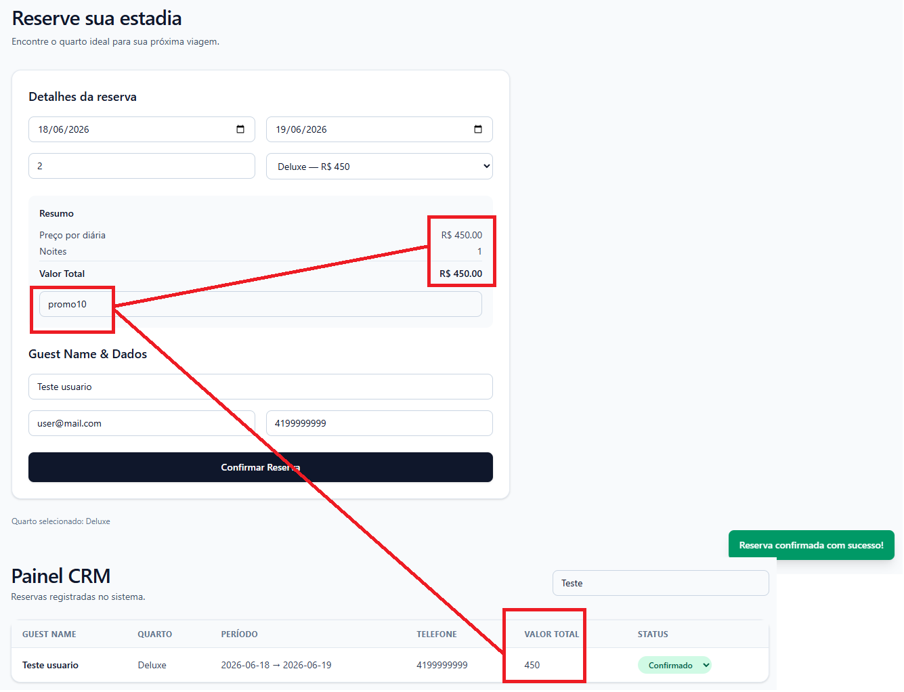


### **CT-015: Realizar reserva com caracteres especiais no Nome Completo**
**Requisitos**
- Estar na aba Reserva

**Passo a Passo**
```
Dado que estou na página de reservas
Quando informo uma data válida de check-in
E informo uma data válida de check-out
E informo a quantidade de hóspedes
E seleciono um quarto "Standard, Deluxe ou Suíte Presidencial"
E preencho o nome completo com "!@#$%¨&*(_+)"
E preencho um e-mail
E preencho um telefone
E clicar no botão confirmar reserva
Então devo visualizar uma mensagem de erro
E a reserva não deve ser exibida na aba CRM
```

**Critério de aceitação**
- Deve informar uma mensagem de erro da reserva
- Não deve cadastrar a reserva na aba CRM
- Deve informar que não é aceito caracteres especiais no campo Nome Completo

**Resultado**
- Mensagem de reserva cadastrada
- Reserva cadastrada na página CRM
- Reserva cadastrada com nome contendo caracteres especiais

**Evidencia de teste referente ao teste CT-015**     
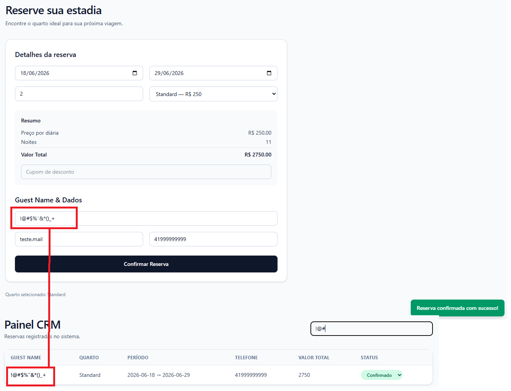


### **CT-016: Realizar reserva com quantidade excessiva de caracteres no Nome Completo**
**Requisitos**
- Estar na aba Reserva

**Passo a Passo**
```
Dado que estou na página de reservas
Quando informo uma data válida de check-in
E informo uma data válida de check-out
E informo a quantidade de hóspedes
E seleciono um quarto "Standard, Deluxe ou Suíte Presidencial"
E preencho o nome completo com excessiva de caracteres
E preencho um e-mail
E preencho um telefone
E clicar no botão confirmar reserva
Então devo visualizar uma mensagem de erro
E a reserva não deve ser exibida na aba CRM
```

**Critério de aceitação**
- Deve informar uma mensagem de erro da reserva
- Não deve cadastrar a reserva na aba CRM
- Deve informar que existe uma quantidade de caracteres

**Resultado**
- Mensagem de reserva cadastrada
- Reserva cadastrada na página CRM
- Reserva cadastrada com quantidade excessiva de caracteres

**Evidencia de teste referente ao teste CT-016**    
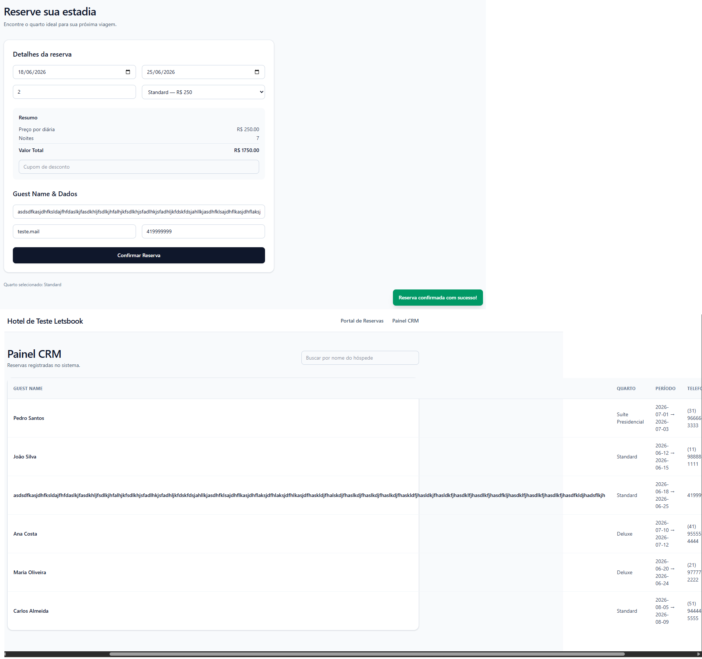


### **CT-017: Realizar reserva informando apenas espaços no Nome Completo**
**Requisitos**
- Estar na aba Reserva

**Passo a Passo**
```
Dado que estou na página de reservas
Quando informo uma data válida de check-in
E informo uma data válida de check-out
E informo a quantidade de hóspedes
E seleciono um quarto "Standard, Deluxe ou Suíte Presidencial"
E preencho o nome completo com "espaços"
E preencho um e-mail
E preencho um telefone
E clicar no botão confirmar reserva
Então devo visualizar uma mensagem de erro
E a reserva não deve ser exibida na aba CRM
```

**Critério de aceitação**
- Deve informar uma mensagem de erro da reserva
- Não deve cadastrar a reserva na aba CRM
- Deve informar que não é aceito "espaço" no Nome Completo

**Resultado**
- Mensagem de reserva cadastrada
- Reserva cadastrada na página CRM
- Reserva cadastrada com "espaços" no Nome Completo

**Evidencia de teste referente ao teste CT-017**      
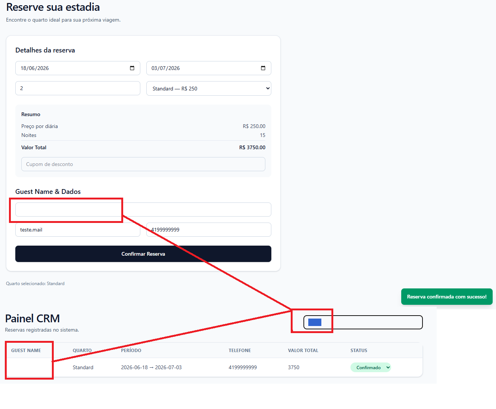


### **CT-018: Realizar reserva com quantidade excessiva de caracteres no E-mail**
**Requisitos**
- Estar na aba Reserva

**Passo a Passo**
```
Dado que estou na página de reservas
Quando informo uma data válida de check-in
E informo uma data válida de check-out
E informo a quantidade de hóspedes
E seleciono um quarto "Standard, Deluxe ou Suíte Presidencial"
E preencho o nome completo com
E preencho um e-mail com excessiva de caracteres
E preencho um telefone
E clicar no botão confirmar reserva
Então devo visualizar uma mensagem de erro
E a reserva não deve ser exibida na aba CRM
```

**Critério de aceitação**
- Deve informar uma mensagem de erro da reserva
- Não deve cadastrar a reserva na aba CRM
- Deve informar que existe uma quantidade excessiva de caracteres no E-mail

**Resultado**
- Mensagem de reserva cadastrada
- Reserva cadastrada na página CRM
- Reserva cadastrada com quantidade excessiva de caracteres no E-mail

**Evidencia de teste referente ao teste CT-018**     
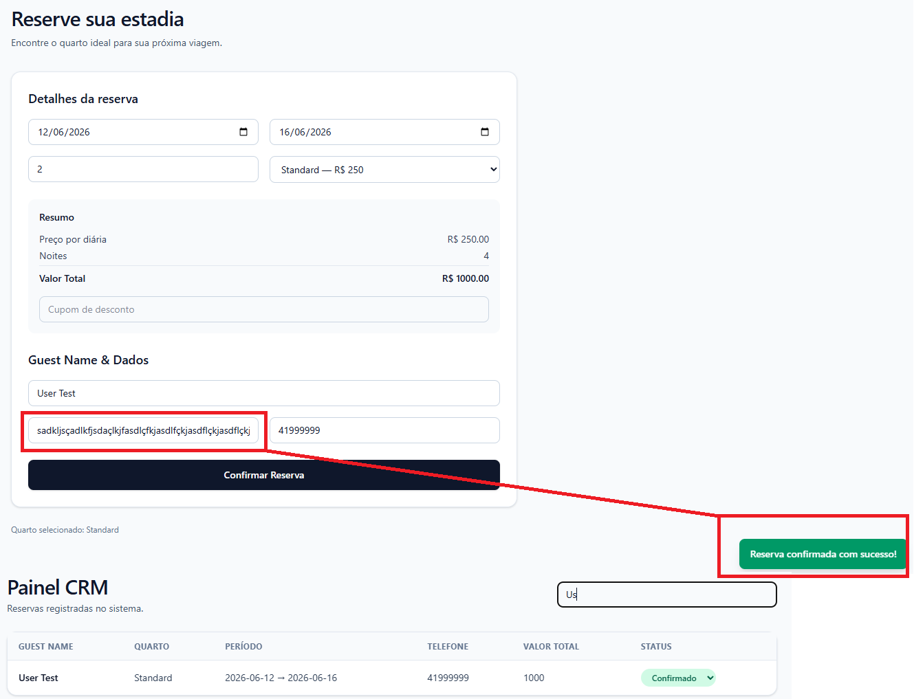


### **CT-019: Realizar reserva informando apenas espaços no E-mail**
**Requisitos**
- Estar na aba Reserva

**Passo a Passo**
```
Dado que estou na página de reservas
Quando informo uma data válida de check-in
E informo uma data válida de check-out
E informo a quantidade de hóspedes
E seleciono um quarto "Standard, Deluxe ou Suíte Presidencial"
E preencho o nome completo
E preencho um e-mail com "espaços"
E preencho um telefone
E clicar no botão confirmar reserva
Então devo visualizar uma mensagem de erro
E a reserva não deve ser exibida na aba CRM
```

**Critério de aceitação**
- Deve informar uma mensagem de erro da reserva
- Não deve cadastrar a reserva na aba CRM
- Deve informar que não é aceito "espaço" no E-mail

**Resultado**
- Mensagem de reserva cadastrada
- Reserva cadastrada na página CRM
- Reserva cadastrada com "espaços" no E-mail

**Evidencia de teste referente ao teste CT-019**   
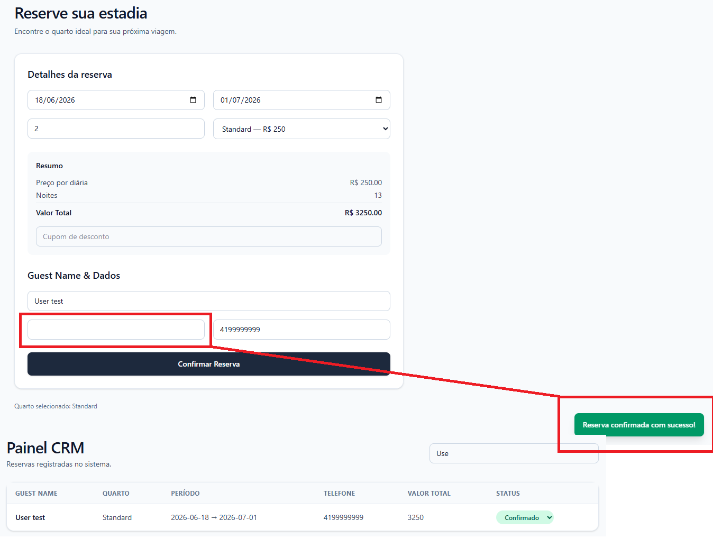


### **CT-020: Realizar reserva sem endereço de e-mail "@mail.com**
**Requisitos**
- Estar na aba Reserva

**Passo a Passo**
```
Dado que estou na página de reservas
Quando informo uma data válida de check-in
E informo uma data válida de check-out
E informo a quantidade de hóspedes
E seleciono um quarto "Standard, Deluxe ou Suíte Presidencial"
E preencho o nome completo
E preencho um e-mail sem "@gmail.com"
E preencho um telefone
E clicar no botão confirmar reserva
Então devo visualizar uma mensagem de erro
E a reserva não deve ser exibida na aba CRM
```

**Critério de aceitação**
- Deve informar uma mensagem de erro da reserva
- Não deve cadastrar a reserva na aba CRM
- Deve informar que é obrigatório "@gmail.com" no campo E-mail

**Resultado**
- Mensagem de reserva cadastrada
- Reserva cadastrada na página CRM
- Reserva cadastrada sem "@gmail.com" no campo E-mail

**Evidencia de teste referente ao teste CT-020**     
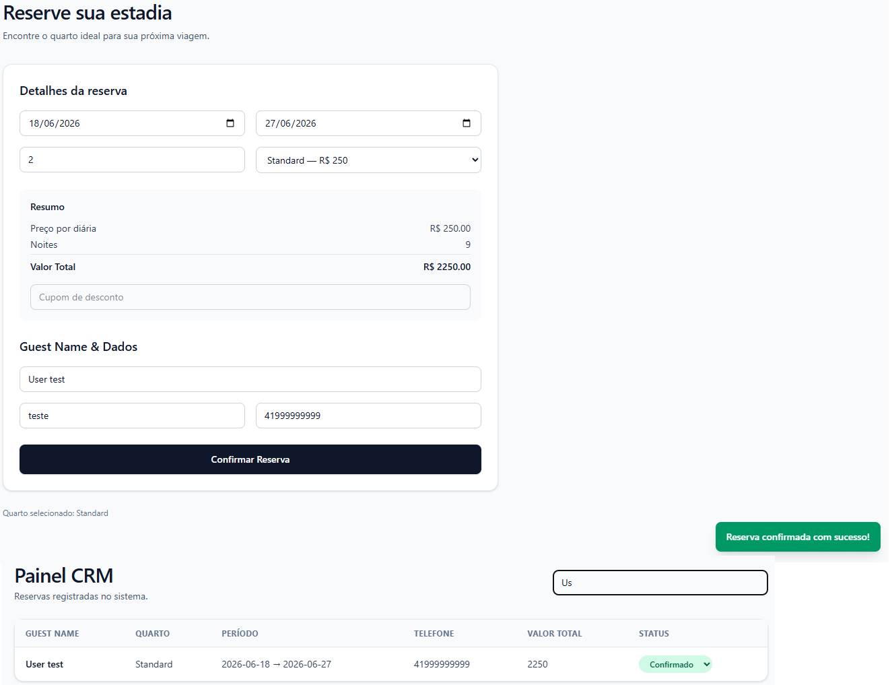


### **CT-021: Realizar reserva com quantidade excessiva de caracteres no Telefone**
**Requisitos**
- Estar na aba Reserva

**Passo a Passo**
```
Dado que estou na página de reservas
Quando informo uma data válida de check-in
E informo uma data válida de check-out
E informo a quantidade de hóspedes
E seleciono um quarto "Standard, Deluxe ou Suíte Presidencial"
E preencho o nome completo
E preencho um e-mail
E preencho um telefone excessivo de caracteres
E clicar no botão confirmar reserva
Então devo visualizar uma mensagem de erro
E a reserva não deve ser exibida na aba CRM
```

**Critério de aceitação**
- Deve informar uma mensagem de erro da reserva
- Não deve cadastrar a reserva na aba CRM
- Deve informar que o campo Telefone contem excessivo de caracteres

**Resultado**
- Mensagem de reserva cadastrada
- Reserva cadastrada na página CRM
- Reserva cadastrada com excessivo de caracteres no Telefone

**Evidencia de teste referente ao teste CT-021**      
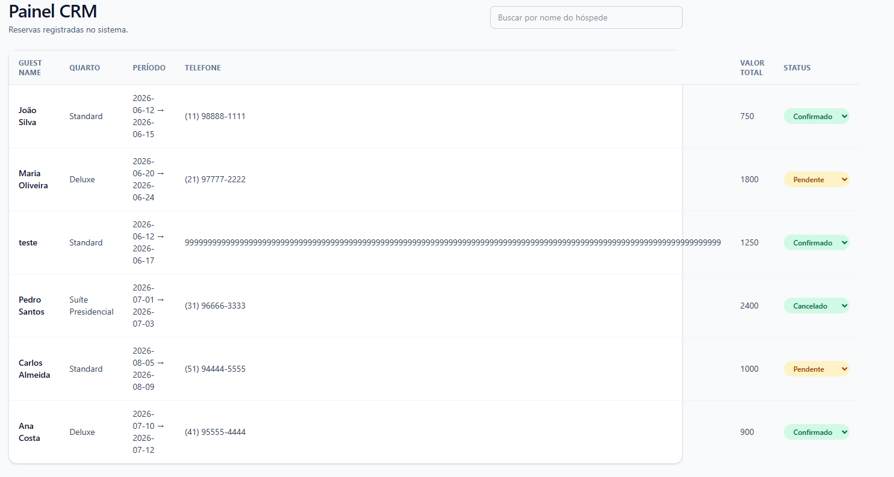


### **CT-022: Realizar reserva informando apenas espaços no Telefone**
**Requisitos**
- Estar na aba Reserva

**Passo a Passo**
```
Dado que estou na página de reservas
Quando informo uma data válida de check-in
E informo uma data válida de check-out
E informo a quantidade de hóspedes
E seleciono um quarto "Standard, Deluxe ou Suíte Presidencial"
E preencho o nome completo
E preencho um e-mail
E preencho um telefone com apenas espaços
E clicar no botão confirmar reserva
Então devo visualizar uma mensagem de erro
E a reserva não deve ser exibida na aba CRM
```

**Critério de aceitação**
- Deve informar uma mensagem de erro da reserva
- Não deve cadastrar a reserva na aba CRM
- Deve informar que o campo Telefone não pode obter espaços

**Resultado**
- Mensagem de reserva cadastrada
- Reserva cadastrada na página CRM
- Reserva cadastrada com campo Telefone contendo espaços

**Evidencia de teste referente ao teste CT-022**      
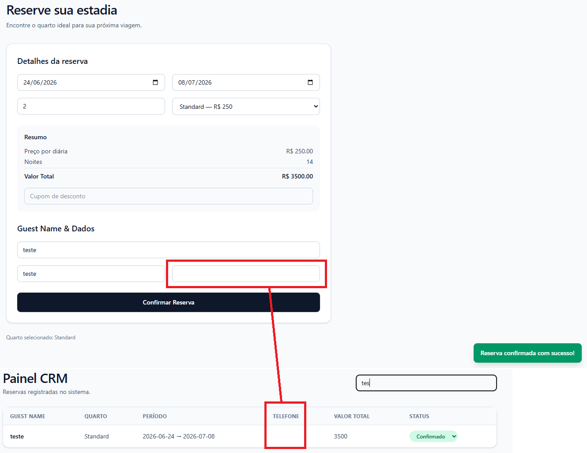


### **CT-023: Realizar reserva com caracteres especiais e letras no Telefone**
**Requisitos**
- Estar na aba Reserva

**Passo a Passo**
```
Dado que estou na página de reservas
Quando informo uma data válida de check-in
E informo uma data válida de check-out
E informo a quantidade de hóspedes
E seleciono um quarto "Standard, Deluxe ou Suíte Presidencial"
E preencho o nome completo
E preencho um e-mail
E preencho um telefone com letras e caracteres especiais
E clicar no botão confirmar reserva
Então devo visualizar uma mensagem de erro
E a reserva não deve ser exibida na aba CRM
```

**Critério de aceitação**
- Deve informar uma mensagem de erro da reserva
- Não deve cadastrar a reserva na aba CRM
- Deve informar que o campo Telefone não pode obter letras e caracteres especiais

**Resultado**
- Mensagem de reserva cadastrada
- Reserva cadastrada na página CRM
- Reserva cadastrada com campo Telefone contendo letras e caracteres especiais

**Evidencia de teste referente ao teste CT-023**     
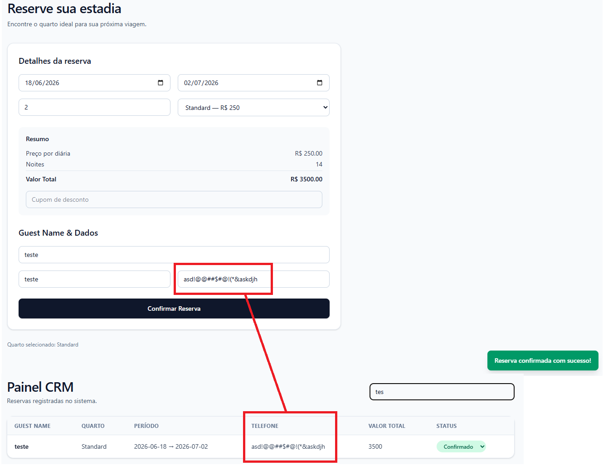


### **CT-024: Realizar reserva confirmando várias vezes**
**Requisitos**
- Estar na aba Reserva

**Passo a Passo**
```
Dado que estou na página de reservas
Quando informo uma data válida de check-in
E informo uma data válida de check-out
E informo a quantidade de hóspedes
E seleciono um quarto "Standard, Deluxe ou Suíte Presidencial"
E preencho o nome completo
E preencho um e-mail
E preencho um telefone
E clicar no botão confirmar reserva várias vezes
Então devo visualizar uma mensagem de erro informando que já foi cadastrado
E a reserva não deve ser exibida na aba CRM apenas uma vez
```

**Critério de aceitação**
- Deve informar uma mensagem de cadastrado realizado com sucesso
- Deve informar uma mensagem de erro da segunda reserva
- Deve cadastrar a reserva na aba CRM apenas uma vez
- Deve informar que essa reserva ja foi feita

**Resultado**
- Mensagem de reserva cadastrada
- Reserva cadastrada na página CRM várias vezes

**Evidencia de teste referente ao teste CT-024**     
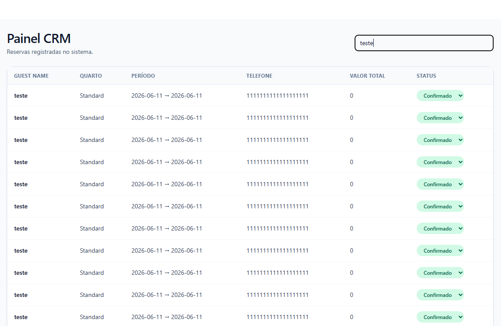


### **CT-025: Validar a responsividade da página de reservas em dispositivos móveis**
**Requisitos**
- Estar na página de reservas.
- Utilizar o DevTools
- resolução quebra 767px

**Passo a Passo**
```
Dado que estou na página de reservas
E altero a visualização para uma resolução mobile inferior a 768px
Quando navego pela página de reservas
Então os elementos da página devem ser exibidos corretamente
E não deve haver sobreposição de informações
E não deve haver quebra de layout
E o botão "Confirmar Reserva" deve permanecer acessível
```

**Critério de aceitação**
- O layout deve se adaptar corretamente à resolução utilizada.
- Todos os campos devem permanecer acessíveis.
- O usuário deve conseguir concluir uma reserva sem dificuldades.

**Resultado**
- Botão de Confirmar Reserva acaba desaparecendo

**Evidencia de teste referente ao teste CT-025**    
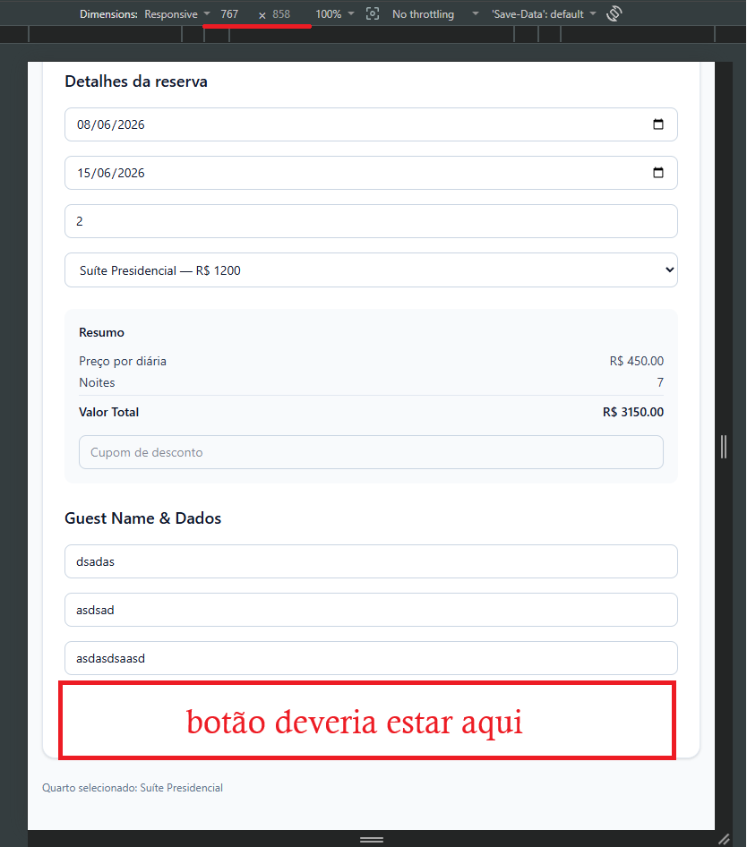


# Painel CRM


### **CT-026: Pesquisar reserva utilizando o nome completo do hóspede**
**Requisitos**
- Estar na aba Painel CRM
- Existir uma reserva cadastrada no Painel CRM.


**Passo a Passo**
```
Dado que estou na página do Painel CRM
Quando informo o nome completo no campo de pesquisa
Então a reserva correspondente deve ser exibida na lista
```

**Critério de aceitação**
- O sistema deve localizar a reserva correspondente ao nome informado.
- Apenas a reserva pesquisada deve ser exibida.

**Resultado**
- Reserva consultada pelo Nome Completo

**Evidencia de teste referente ao teste CT-026**    
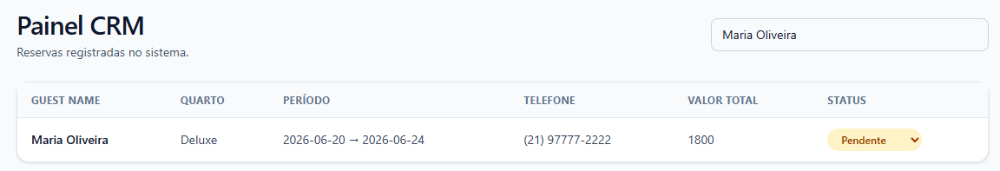


### **CT-027: Pesquisar reserva utilizando parte do nome do hóspede**    
**Requisitos**
- Estar na aba Painel CRM
- Existir uma reserva cadastrada no Painel CRM.


**Passo a Passo**
```
Dado que estou na página do Painel CRM
Quando informo o nome do meio no campo de pesquisa
Então a reserva correspondente deve ser exibida na lista
```

**Critério de aceitação**
- O sistema deve localizar a reserva correspondente ao nome informado.
- Apenas a reserva pesquisada deve ser exibida.

**Resultado**
- Reserva consultada pelo nome do meio

**Evidencia de teste referente ao teste CT-027**    
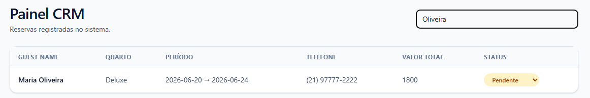


### **CT-028: Pesquisar reserva utilizando o nome completo do hóspede em letras minúsculas**    
**Requisitos**
- Estar na aba Painel CRM
- Existir uma reserva cadastrada no Painel CRM.

**Passo a Passo**
```
Dado que estou na página do Painel CRM
Quando informo o nome em letras minúsculas no campo de pesquisa 
Então a reserva correspondente deve ser exibida na lista
```

**Critério de aceitação**
- O sistema deve localizar a reserva correspondente ao nome em letras minúsculas.
- Apenas a reserva pesquisada deve ser exibida.

**Resultado**
- Reserva não foi consultada com letras minúsculas
 
**Evidencia de teste referente ao teste CT-028**     
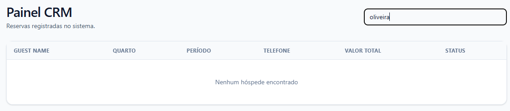


### **CT-029: Pesquisar reserva utilizando um nome inexistente**    
**Requisitos**
- Estar na aba Painel CRM
- Não conter a reserva com o nome que irá consultar

**Passo a Passo**
```
Dado que estou na página do Painel CRM
Quando informo um nome que não exista na busca
Então não deve listar nenhuma reserva
```

**Critério de aceitação**
- Não deve listar nomes inexistentes
- Deve conter uma mensagem informando que não foi encontrado o hóspede

**Resultado**
- A reserva que foi consultada com o nome inexistente não foi listado

**Evidencia de teste referente ao teste CT-029**   
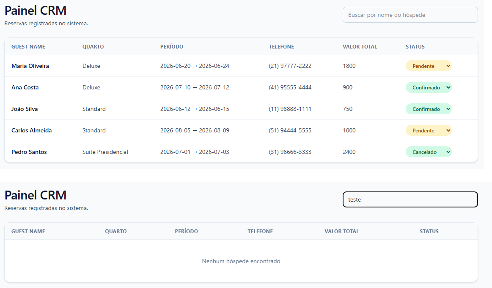


### **CT-030: Alterar o status da reserva para "Pendente"**   
**Requisitos**
- Existir uma reserva cadastrada no Painel CRM.
- A reserva não deve estar com o status "Pendente".

**Passo a Passo**
```
Dado que estou na página do Painel CRM
Quando altero o status da reserva para "Pendente"
Então o status da reserva deve ser atualizado para "Pendente"
```

**Critério de aceitação**
- O sistema deve atualizar o status da reserva corretamente.

**Resultado**
- Alterado o status de "Confirmado" para "Pendente"

**Evidencia de teste referente ao teste CT-030**  
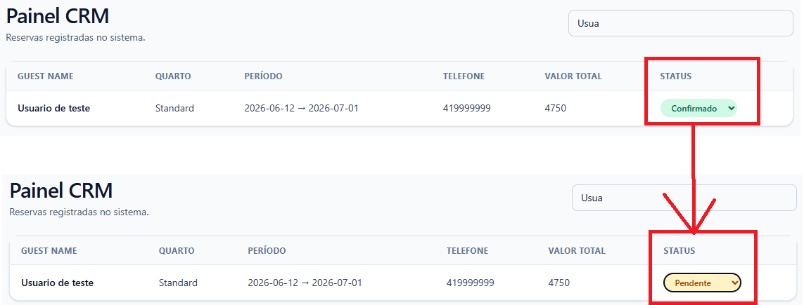


### **CT-031: Alterar o status da reserva para "Confirmado"**   
**Requisitos**
- Existir uma reserva cadastrada no Painel CRM.
- A reserva não deve estar com o status "Confirmado".

**Passo a Passo**
```
Dado que estou na página do Painel CRM
Quando altero o status da reserva para "Confirmado"
Então o status da reserva deve ser atualizado para "Confirmado"
```

**Critério de aceitação**
- O sistema deve atualizar o status da reserva corretamente.

**Resultado**
- Alterado o status de "Pendente" para "Confirmado"

**Evidencia de teste referente ao teste CT-031**      
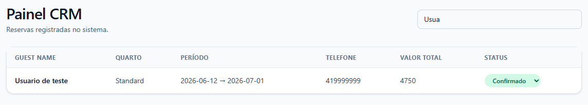


### **CT-032: Alterar o status da reserva para "Cancelado"**   
**Requisitos**
- Existir uma reserva cadastrada no Painel CRM.
- A reserva não deve estar com o status "Cancelado".

**Passo a Passo**
```
Dado que estou na página do Painel CRM
Quando altero o status da reserva para "Cancelado"
Então o status da reserva deve ser atualizado para "Cancelado"
```

**Critério de aceitação**
- O sistema deve atualizar o status da reserva corretamente.

**Resultado**
- Alterado o status de "Confirmado" para "Cancelado"

**Evidencia de teste referente ao teste CT-032**      
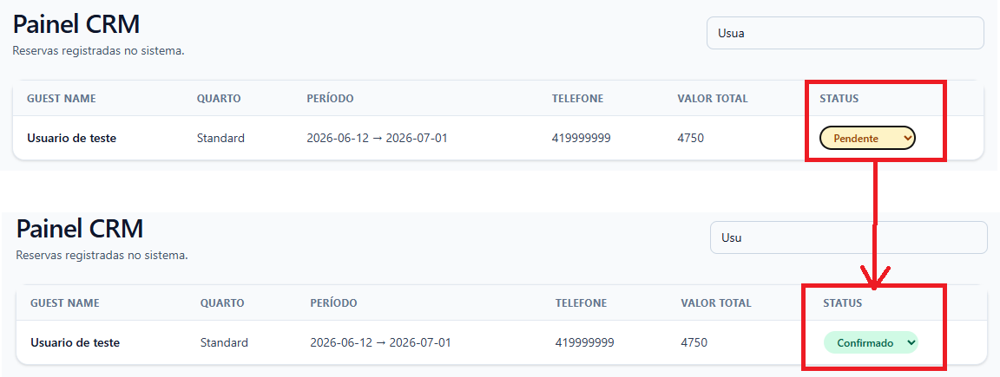


### **CT-033: Validar a responsividade da página Painel CRM**   
**Requisitos**
- Estar na página do Painel CRM.
- Utilizar o DevTools
- Resolução recomendada 430px

**Passo a Passo**
```
Dado que estou na página do Painel CRM
E altero a visualização para uma resolução mobile inferior a 600px
Quando navego pela página de CRM
Então os elementos da página devem ser exibidos corretamente
E não deve haver sobreposição de informações
E não deve haver quebra de layout
```

**Critério de aceitação**
- O layout deve se adaptar corretamente à resolução utilizada.
- Todos os campos devem permanecer acessíveis.
- O usuário deve realizar uma consulta

**Resultado**
- Layout quebrado

**Evidencia de teste referente ao teste CT-033**     
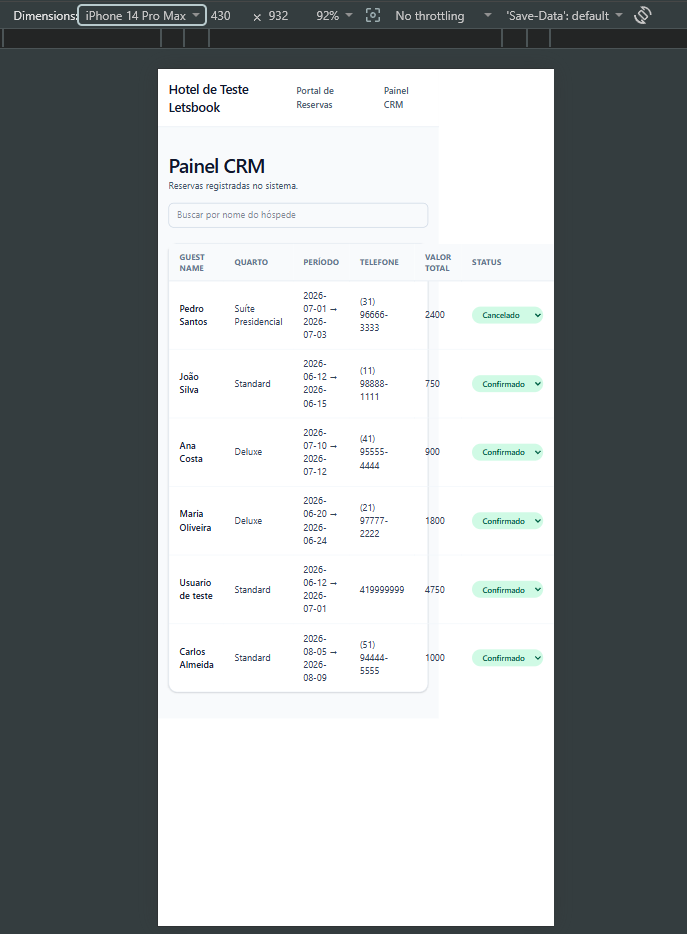
